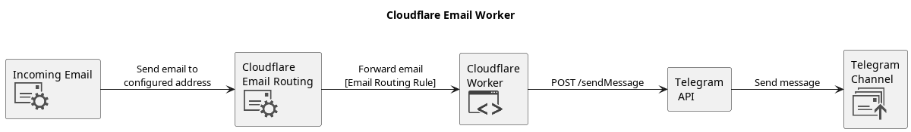

# cloudflare-email-worker

A basic cloudflare email worker to forward emails to Telegram. This can be useful to send on OTP password for streaming services. Currently only sends the email body.

Cloudflare -> Domain -> Email Routing -> Enable has to be manually enabled, for now.



## Setup

Copy the `terraform.tfvars.example` to `terraform.tfvars` and update each variable.

Cloudflare account and zone IDs can be found on the domain page.

Create an Account API token (Manage Account -> Account API Token) with the following permissions:

| Area    | Permission              | Level |
| ------- | ----------------------- | ----- |
| Account | Email Routing Addresses | Edit  |
| Account | Worker Scripts          | Edit  |
| Zone    | Email Routing Rules     | Edit  |
| Zone    | Zone                    | Read  |


## Prerequisites

- [OpenTofu](https://opentofu.org/docs/intro/install/)
- [NodeJS](https://nodejs.org/en)
- [Telegram Bot](https://core.telegram.org/bots/tutorial#getting-ready)

## Deployment

```
yarn install
tofu plan
tofu apply
```
